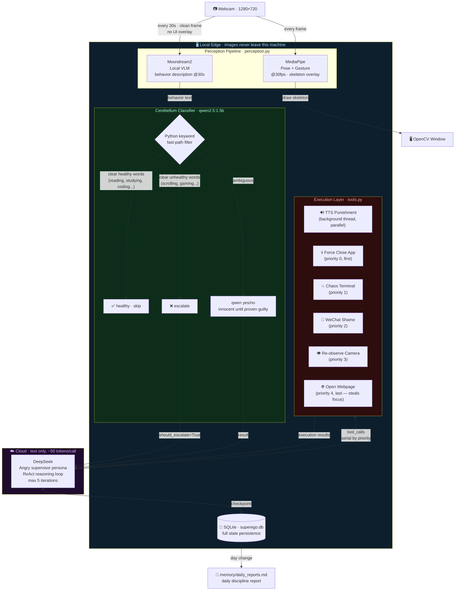
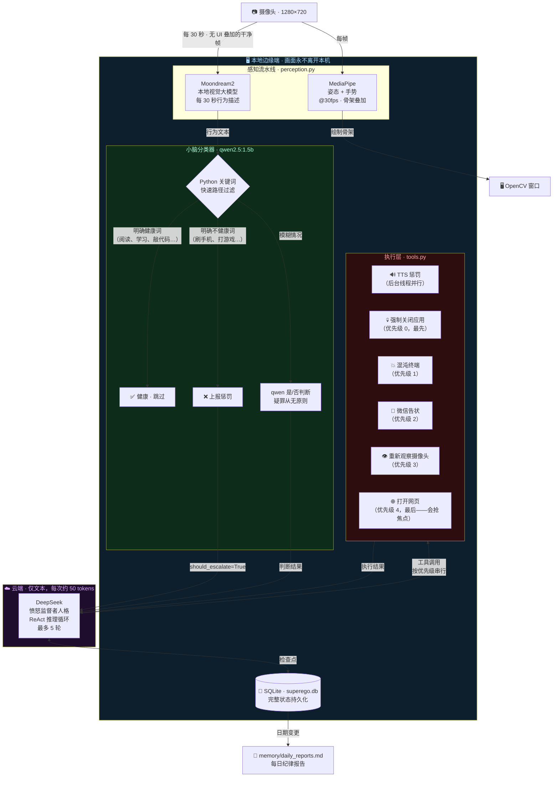
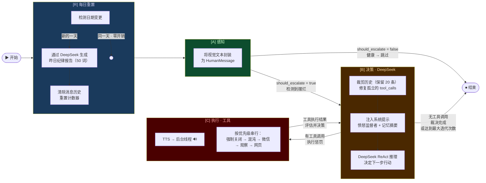

<div align="center">

# 🧠 Cyber-Superego · 赛博超我

**An edge-cloud hybrid AI agent that watches you work — and punishes you when you don't.**

**隐私优先的边缘-云端混合 AI 监督 Agent，全天候监控你的行为，一旦摆烂立即惩罚。**

*Powered by LangGraph · MediaPipe · Moondream2 · DeepSeek · macOS Automation*

[](https://python.org)
[](https://langchain-ai.github.io/langgraph/)
[](LICENSE)
[](https://apple.com/macos)
[](https://ollama.com)

[English](#english) · [中文](#中文)

</div>

---

## English

### What is this?

Cyber-Superego is a **privacy-first, edge-cloud hybrid AI supervisor** that monitors your behavior through your webcam 24/7 and intervenes with escalating punishments the moment it detects procrastination.

The core design insight: **your camera image never leaves your machine.** A local vision model describes what it sees in plain text; only that text description reaches the cloud LLM. This keeps API costs minimal and protects your privacy.

### What can it do?

| Detected Behavior | System Response |
|---|---|
| Scrolling phone / watching videos | TTS voice scolds you out loud |
| Still slacking after warning | Sends a shame message to your mom on WeChat |
| Gaming when you should be studying | Force-closes the game, opens LeetCode |
| Repeatedly ignoring warnings | **Chaos mode**: 50 terminal windows flood your screen, 5-language concurrent TTS |
| Actually studying | Leaves you alone (with a brief sarcastic comment) |

### Architecture

The system uses a **Dual-Brain Synergy** design to solve the fundamental tension between privacy, cost, and intelligence:

```
┌─────────────────────────────────────────────────────────────┐
│  LOCAL EDGE  (images never leave this machine)              │
│                                                             │
│  Webcam → MediaPipe    → skeleton overlay on screen         │
│         ↓ (every 30s)                                       │
│         → Moondream2   → plain-text behavior description    │
│         → qwen2.5:1.5b → healthy / procrastinating?         │
│                              ↓ (if procrastinating)         │
├──────────────────────────────┼──────────────────────────────┤
│  CLOUD  (text only, ~50 tokens per call)                    │
│                              ↓                              │
│              DeepSeek → ReAct reasoning loop                │
│                              ↓                              │
├──────────────────────────────┼──────────────────────────────┤
│  LOCAL EXECUTION             ↓                              │
│         TTS / WeChat automation / force-close / chaos mode  │
└─────────────────────────────────────────────────────────────┘
```



### LangGraph State Machine

Every 30-second perception cycle triggers one full graph execution. The `[B] ⇌ [C]` loop runs up to 5 times, delivering escalating punishment until the subject complies or the limit is reached.


### Cerebellum: Three-Layer Behavior Classifier

Before any cloud call, a local three-layer classifier filters behavior descriptions to minimize unnecessary API usage:

```
Vision text (e.g. "person reading a programming book at desk")
        │
        ▼
Layer 1 · Python whitelist (zero LLM cost)
  keywords: "reading a book", "studying", "coding", "working at desk"...
        → immediately healthy ✅ (most study sessions caught here)
        │
        ▼ (not matched)
Layer 2 · Python blacklist (zero LLM cost)
  keywords: "scrolling", "gaming", "watching tv", "lying in bed"...
        → immediately escalate ❌
        │
        ▼ (ambiguous)
Layer 3 · qwen2.5:1.5b yes/no classification
  "Is this person clearly doing something unproductive?"
  Rule: innocent until proven guilty — unclear answer → healthy default
```

> **Why not inject conversation history into qwen?** Testing showed that feeding the small 1.5B model prior LLM conversations (containing scolding text in Chinese) caused ~12% false-positive rate on clearly healthy behaviors. The classifier now sees only the current frame description.

### Punishment Escalation

```
Round 1 · TTS voice warning          "你他妈在干嘛，给老子去学习！"
Round 2 · observe_camera             Wait 30s, re-check behavior
Round 3 · TTS + WeChat + webpage     Three-hit combo — mom gets a message
Round 4 · chaos_terminal_punishment  50 terminals + 5-language concurrent TTS
Round 5 · forced END                 Max iterations reached
```

### Key Design Decisions

| Decision | Rationale |
|---|---|
| Images stay local | Privacy + zero vision API cost |
| qwen2.5:1.5b as cerebellum | 99% of classifications need no cloud call |
| DeepSeek for decisions | Reasoning quality at minimal token cost |
| TTS runs in background thread | Non-blocking; plays while other tools execute |
| Tools execute serially by priority | WeChat automation needs focus; browser runs last |
| `_reorder_and_repair` message repair | Crash-safe: orphaned tool_calls in SQLite are patched on restart |

### Setup Guide

#### Requirements

| Requirement | Details |
|---|---|
| **OS** | macOS (required for `say`, `osascript`, `open -a`) |
| **Python** | 3.12+ |
| **Package manager** | [uv](https://docs.astral.sh/uv/) |
| **Ollama** | [ollama.com](https://ollama.com) |
| **DeepSeek API** | [platform.deepseek.com](https://platform.deepseek.com) |

#### Step 1 — Clone and install dependencies

```bash
git clone https://github.com/yourname/wakeupagent.git
cd wakeupagent
uv sync
```

#### Step 2 — Pull local models via Ollama

```bash
# Start Ollama first
open /Applications/Ollama.app

# Pull the two required models (~2 GB total)
ollama pull moondream      # Vision model — describes what the camera sees
ollama pull qwen2.5:1.5b   # Cerebellum — classifies behavior as healthy/unhealthy
```

#### Step 3 — Download MediaPipe model files

Download these two files and place them in the project root directory:

| File | Size | Link |
|---|---|---|
| `pose_landmarker_lite.task` | 5.5 MB | [Download](https://storage.googleapis.com/mediapipe-models/pose_landmarker/pose_landmarker_lite/float16/latest/pose_landmarker_lite.task) |
| `gesture_recognizer.task` | 8 MB | [Download](https://storage.googleapis.com/mediapipe-models/gesture_recognizer/gesture_recognizer/float16/latest/gesture_recognizer.task) |

#### Step 4 — Configure environment

```bash
cp .env.example .env
```

Edit `.env`:
```
DEEPSEEK_API_KEY=your_deepseek_api_key_here
```

#### Step 5 — Customize contacts in config.py

Open `config.py` and replace the placeholder WeChat contact names:

```python
WECHAT_CONTACTS = {
    "老妈":   "YOUR_MOM_WECHAT_NAME",   # Exact name as shown in WeChat search
    "导师":   "YOUR_TUTOR_WECHAT_NAME",
    "班级群": "YOUR_CLASS_GROUP_NAME",
}
```

> ⚠️ These values must **exactly match** how the contact appears in WeChat's search bar.

#### Step 6 — Grant Accessibility permission (WeChat automation)

**System Settings → Privacy & Security → Accessibility**

Add your terminal app (Terminal / iTerm2 / Cursor / VS Code). This is required for the `osascript` WeChat automation to work.

#### Step 7 — Run

```bash
# Full system — live webcam + AI supervision
uv run main.py

# Test the LangGraph flow without a camera (mock input)
uv run main.py --graph

# Test perception pipeline only — camera + MediaPipe + Moondream, no cloud
uv run perception.py
```

#### Startup checklist

- [ ] Ollama is running with `moondream` and `qwen2.5:1.5b` pulled
- [ ] Both `.task` model files are in the project root
- [ ] `.env` contains a valid `DEEPSEEK_API_KEY`
- [ ] Terminal has Accessibility permission (for WeChat)
- [ ] WeChat Mac client is logged in and running
- [ ] `WECHAT_CONTACTS` in `config.py` has real contact names

### Configuration Reference

All settings live in `config.py`. No other files need to be edited for normal use.

| Parameter | Default | Description |
|---|---|---|
| `CAMERA_INDEX` | `0` | Webcam index. Use `1` or `2` for external cameras |
| `CAPTURE_INTERVAL_SEC` | `30` | Seconds between Moondream vision analyses |
| `REACT_MAX_ITERATIONS` | `5` | Max punishment rounds per session |
| `CONTEXT_MAX_MESSAGES` | `20` | Recent messages kept in LLM context |
| `SUMMARIZE_THRESHOLD` | `30` | Message count that triggers memory compression |
| `LOCAL_CLASSIFIER_MODEL` | `qwen2.5:1.5b` | Cerebellum model (must be available in Ollama) |
| `DEEPSEEK_MODEL` | `deepseek-chat` | Cloud brain model |
| `MOONDREAM_PROMPT` | `"What is the person doing?"` | Controls Moondream's description angle |
| `WECHAT_CONTACTS` | placeholders | **Must be customized** — WeChat contact names |

### File Structure

```
wakeupagent/
│
├── main.py                     # Entry point — wires perception callbacks to graph execution
├── graph.py                    # LangGraph state machine — 4 nodes, routing, memory compression
├── perception.py               # Perception pipeline — MediaPipe + Moondream + cerebellum
├── tools.py                    # Execution tool library — all 6 tools fully implemented
├── config.py                   # All configuration in one place
│
├── pose_landmarker_lite.task   # MediaPipe Pose model (download separately, not in repo)
├── gesture_recognizer.task     # MediaPipe Gesture model (download separately, not in repo)
│
├── pyproject.toml              # Dependencies (managed with uv)
├── .env.example                # Environment variable template
├── .env                        # Your API keys — never commit this
│
└── memory/
    └── daily_reports.md        # Auto-generated daily discipline reports (runtime)
```

### FAQ

**Q: The system keeps flagging me as procrastinating even when I'm studying.**
The cerebellum uses "innocent until proven guilty" — ambiguous cases default to healthy. If you're consistently misclassified, add the specific words Moondream uses to describe your activity to `_HEALTHY_KEYWORDS` in `perception.py`.

**Q: WeChat messages aren't sending.**
Check: (1) WeChat Mac is logged in and running; (2) your terminal has Accessibility permission; (3) `WECHAT_CONTACTS` values exactly match WeChat search results (including spaces and special characters).

**Q: Can I use a different cloud LLM instead of DeepSeek?**
Yes — DeepSeek uses an OpenAI-compatible API. Change `DEEPSEEK_BASE_URL` and `DEEPSEEK_MODEL` in `config.py` to point at any OpenAI-compatible endpoint (OpenAI, Claude via proxy, etc.).

**Q: The TTS voice sounds wrong / I want a different voice.**
Change `_TTS_VOICE` in `tools.py` to any voice installed on your system. Check available voices in: System Settings → Accessibility → Spoken Content → System Voice.

**Q: Can I run this without WeChat?**
Yes — the system degrades gracefully. If WeChat automation fails, it logs the error and moves on to the next tool. You can also remove `send_wechat_shame_message` from `ALL_TOOLS` in `tools.py`.

### Roadmap

- [ ] **Human confirmation**: `interrupt_before` checkpoint for high-risk tools (WeChat, chaos mode)
- [ ] **Cross-platform**: Windows/Linux support via alternative TTS and automation backends
- [ ] **Web UI**: Browser-based monitoring dashboard with `AsyncSqliteSaver` + `astream`
- [ ] **Multi-camera**: Monitor multiple rooms simultaneously
- [ ] **Custom punishment plugins**: Hot-reloadable tool modules
- [ ] **Mobile companion app**: Push notifications when punishment is triggered

### License

MIT — do whatever you want, but the author takes no responsibility for family relationship damage caused by unsolicited WeChat messages.

---

## 中文

### 这是什么？

赛博超我是一个**隐私优先的边缘-云端混合 AI 监督 Agent**，通过摄像头全天候监控你的行为，一旦检测到摆烂立即介入并施以渐进式惩罚。

核心设计原则：**摄像头画面永远不离开你的设备。** 本地视觉模型将画面描述为纯文本，云端 LLM 只接收这段文字，既保护隐私，又将 API 成本压到极低。

### 它能做什么？

| 检测行为 | 系统响应 |
|---|---|
| 刷手机 / 看视频 | TTS 语音当场骂你 |
| 警告后仍在摆烂 | 给你妈发微信告状 |
| 该学习时打游戏 | 强制关闭游戏，打开 LeetCode |
| 屡教不改 | **混沌模式**：50 个终端刷屏 + 5 语言 TTS 同时开轰 |
| 认真学习 | 冷嘲一句，不打扰 |

### 系统架构

系统采用**双脑协同**设计，从根本上解决隐私、成本、智能三者之间的矛盾：

```
┌─────────────────────────────────────────────────────────────┐
│  本地边缘端（摄像头画面永远不离开本机）                       │
│                                                             │
│  摄像头 → MediaPipe    → 屏幕骨架叠加                        │
│         ↓ (每 30 秒)                                        │
│         → Moondream2   → 纯文本行为描述                      │
│         → qwen2.5:1.5b → 健康 / 摆烂？                      │
│                              ↓ (若摆烂)                     │
├──────────────────────────────┼──────────────────────────────┤
│  云端（仅文本，每次约 50 tokens）                             │
│                              ↓                              │
│              DeepSeek → ReAct 推理循环                       │
│                              ↓                              │
├──────────────────────────────┼──────────────────────────────┤
│  本地执行                    ↓                              │
│         TTS / 微信自动化 / 强制关闭 / 混沌模式               │
└─────────────────────────────────────────────────────────────┘
```



### LangGraph 状态机

每隔 30 秒，感知周期触发一次完整的图执行。`[B] ⇌ [C]` 循环最多运行 5 轮，持续升级惩罚直到被监督者服从或达到上限。



### 小脑：三层行为分类器

在任何云端调用之前，本地三层分类器会过滤行为描述，将不必要的 API 调用降到最低：

```
视觉文本（例如："person reading a programming book at desk"）
        │
        ▼
第一层 · Python 白名单（零 LLM 开销）
  关键词："reading a book"、"studying"、"coding"、"working at desk"…
        → 立即判定健康 ✅（大多数学习状态在此拦截）
        │
        ▼ （未命中）
第二层 · Python 黑名单（零 LLM 开销）
  关键词："scrolling"、"gaming"、"watching tv"、"lying in bed"…
        → 立即触发惩罚 ❌
        │
        ▼ （模糊情况）
第三层 · qwen2.5:1.5b 是/否分类
  "这个人是否明显在做无意义的事情？"
  原则：疑罪从无 —— 不确定 → 默认健康
```

> **为什么不把对话历史注入 qwen？** 测试发现，将包含中文骂人内容的大脑对话历史喂给 1.5B 小模型后，明显健康的行为误判率高达 ~12%。现在分类器只看当前帧的描述。

### 惩罚升级机制

```
第 1 轮 · TTS 语音警告          "你他妈在干嘛，给老子去学习！"
第 2 轮 · observe_camera         等待 30 秒，重新观察行为
第 3 轮 · TTS + 微信 + 网页      三连击 —— 家长收到告状消息
第 4 轮 · chaos_terminal          50 个终端刷屏 + 5 语言并发 TTS
第 5 轮 · 强制结束               达到最大迭代次数
```

### 关键设计决策

| 决策 | 理由 |
|---|---|
| 图像留在本地 | 保护隐私 + 视觉 API 零成本 |
| qwen2.5:1.5b 作为小脑 | 99% 的分类无需云端调用 |
| DeepSeek 负责决策 | 以极低 token 成本获得推理质量 |
| TTS 在后台线程运行 | 非阻塞；播放音频同时其他工具并行执行 |
| 工具按优先级串行执行 | 微信自动化需要焦点；浏览器放最后 |
| `_reorder_and_repair` 消息修复 | 崩溃安全：重启时修复 SQLite 中的孤立 tool_calls |

### 部署教程

#### 环境要求

| 需求 | 详情 |
|---|---|
| **操作系统** | macOS（`say`、`osascript`、`open -a` 均依赖 macOS） |
| **Python** | 3.12+ |
| **包管理器** | [uv](https://docs.astral.sh/uv/) |
| **Ollama** | [ollama.com](https://ollama.com) |
| **DeepSeek API** | [platform.deepseek.com](https://platform.deepseek.com) |

#### 第一步 — 克隆仓库并安装依赖

```bash
git clone https://github.com/yourname/wakeupagent.git
cd wakeupagent
uv sync
```

#### 第二步 — 通过 Ollama 拉取本地模型

```bash
# 先启动 Ollama
open /Applications/Ollama.app

# 拉取两个必需模型（共约 2 GB）
ollama pull moondream      # 视觉模型 —— 描述摄像头画面
ollama pull qwen2.5:1.5b   # 小脑分类器 —— 判断行为健康与否
```

#### 第三步 — 下载 MediaPipe 模型文件

下载以下两个文件并放入项目根目录：

| 文件 | 大小 | 链接 |
|---|---|---|
| `pose_landmarker_lite.task` | 5.5 MB | [下载](https://storage.googleapis.com/mediapipe-models/pose_landmarker/pose_landmarker_lite/float16/latest/pose_landmarker_lite.task) |
| `gesture_recognizer.task` | 8 MB | [下载](https://storage.googleapis.com/mediapipe-models/gesture_recognizer/gesture_recognizer/float16/latest/gesture_recognizer.task) |

#### 第四步 — 配置环境变量

```bash
cp .env.example .env
```

编辑 `.env`：
```
DEEPSEEK_API_KEY=你的_deepseek_api_key
```

#### 第五步 — 在 config.py 中配置微信联系人

打开 `config.py`，将占位符替换为真实的微信联系人名称：

```python
WECHAT_CONTACTS = {
    "老妈":   "妈妈",     # 在微信搜索栏中显示的精确名称
    "导师":   "导师",
    "班级群": "班级群",
}
```

> ⚠️ 这些值必须与微信搜索栏中显示的名称**完全一致**，包括空格和特殊字符。

#### 第六步 — 授予辅助功能权限（微信自动化必需）

**系统设置 → 隐私与安全性 → 辅助功能**

添加你的终端应用（Terminal / iTerm2 / Cursor / VS Code）。这是 `osascript` 微信自动化正常工作的前提。

#### 第七步 — 运行

```bash
# 完整系统 —— 实时摄像头 + AI 监督
uv run main.py

# 不需要摄像头，测试 LangGraph 图流转（mock 输入）
uv run main.py --graph

# 仅测试感知流水线 —— 摄像头 + MediaPipe + Moondream，不调用云端
uv run perception.py
```

#### 启动前检查清单

- [ ] Ollama 正在运行，且已拉取 `moondream` 和 `qwen2.5:1.5b`
- [ ] 两个 `.task` 模型文件在项目根目录
- [ ] `.env` 中填写了有效的 `DEEPSEEK_API_KEY`
- [ ] 终端已获得辅助功能权限（微信自动化需要）
- [ ] 微信 Mac 客户端已登录并运行
- [ ] `config.py` 中的 `WECHAT_CONTACTS` 已填写真实联系人名称

### 配置参考

所有配置均在 `config.py` 中，正常使用无需修改其他文件。

| 参数 | 默认值 | 说明 |
|---|---|---|
| `CAMERA_INDEX` | `0` | 摄像头索引，外接摄像头用 `1` 或 `2` |
| `CAPTURE_INTERVAL_SEC` | `30` | Moondream 视觉分析的时间间隔（秒） |
| `REACT_MAX_ITERATIONS` | `5` | 每次惩罚会话的最大推理轮数 |
| `CONTEXT_MAX_MESSAGES` | `20` | LLM 上下文中保留的最近消息数 |
| `SUMMARIZE_THRESHOLD` | `30` | 触发历史压缩的消息数阈值 |
| `LOCAL_CLASSIFIER_MODEL` | `qwen2.5:1.5b` | 小脑模型（需在 Ollama 中可用） |
| `DEEPSEEK_MODEL` | `deepseek-chat` | 云端大脑模型 |
| `MOONDREAM_PROMPT` | `"What is the person doing?"` | Moondream 的描述提示词 |
| `WECHAT_CONTACTS` | 占位符 | **必须自定义** —— 微信联系人名称 |

### 文件结构

```
wakeupagent/
│
├── main.py                     # 入口 —— 感知回调与图执行的连接
├── graph.py                    # LangGraph 状态机 —— 4 节点 + 路由 + 记忆压缩
├── perception.py               # 感知流水线 —— MediaPipe + Moondream + 小脑分类器
├── tools.py                    # 执行工具库 —— 全部 6 个工具真实实现
├── config.py                   # 所有配置集中管理
│
├── pose_landmarker_lite.task   # MediaPipe 姿态模型（单独下载，不在仓库中）
├── gesture_recognizer.task     # MediaPipe 手势模型（单独下载，不在仓库中）
│
├── pyproject.toml              # 依赖管理（uv）
├── .env.example                # 环境变量模板
├── .env                        # 你的 API 密钥 —— 绝不提交此文件
│
└── memory/
    └── daily_reports.md        # 自动生成的每日纪律报告（运行时产生）
```

### 常见问题

**Q: 我在认真学习，但系统总是把我判定为摆烂。**
小脑使用"疑罪从无"原则 —— 模糊情况默认为健康。如果你持续被误判，将 Moondream 描述你行为时使用的具体词语添加到 `perception.py` 的 `_HEALTHY_KEYWORDS` 中。

**Q: 微信消息发不出去。**
检查：(1) 微信 Mac 已登录并在运行；(2) 终端已获得辅助功能权限；(3) `WECHAT_CONTACTS` 的值与微信搜索结果完全一致（包括空格和特殊字符）。

**Q: 能用 DeepSeek 以外的云端 LLM 吗？**
可以 —— DeepSeek 使用 OpenAI 兼容接口。在 `config.py` 中修改 `DEEPSEEK_BASE_URL` 和 `DEEPSEEK_MODEL`，指向任意 OpenAI 兼容的端点（OpenAI、Claude 代理等）。

**Q: TTS 声音不对 / 想换个声音。**
将 `tools.py` 中的 `_TTS_VOICE` 改为系统已安装的任意声音。可在系统设置 → 辅助功能 → 朗读内容 → 系统声音中查看可用声音列表。

**Q: 不用微信可以运行吗？**
可以 —— 系统会优雅降级。微信自动化失败时，系统记录错误并继续执行下一个工具。也可以直接将 `send_wechat_shame_message` 从 `tools.py` 的 `ALL_TOOLS` 中移除。

### 路线图

- [ ] **人工确认**：为高风险工具（微信、混沌模式）添加 `interrupt_before` 检查点
- [ ] **跨平台支持**：通过替代 TTS 和自动化后端支持 Windows/Linux
- [ ] **Web UI**：基于 `AsyncSqliteSaver` + `astream` 的浏览器监控面板
- [ ] **多摄像头**：同时监控多个房间
- [ ] **自定义惩罚插件**：热重载工具模块
- [ ] **移动端伴侣 App**：惩罚触发时推送通知

### 许可证

MIT —— 随便用，但作者对任何因不请自来的微信消息导致的家庭关系损害不承担责任。
