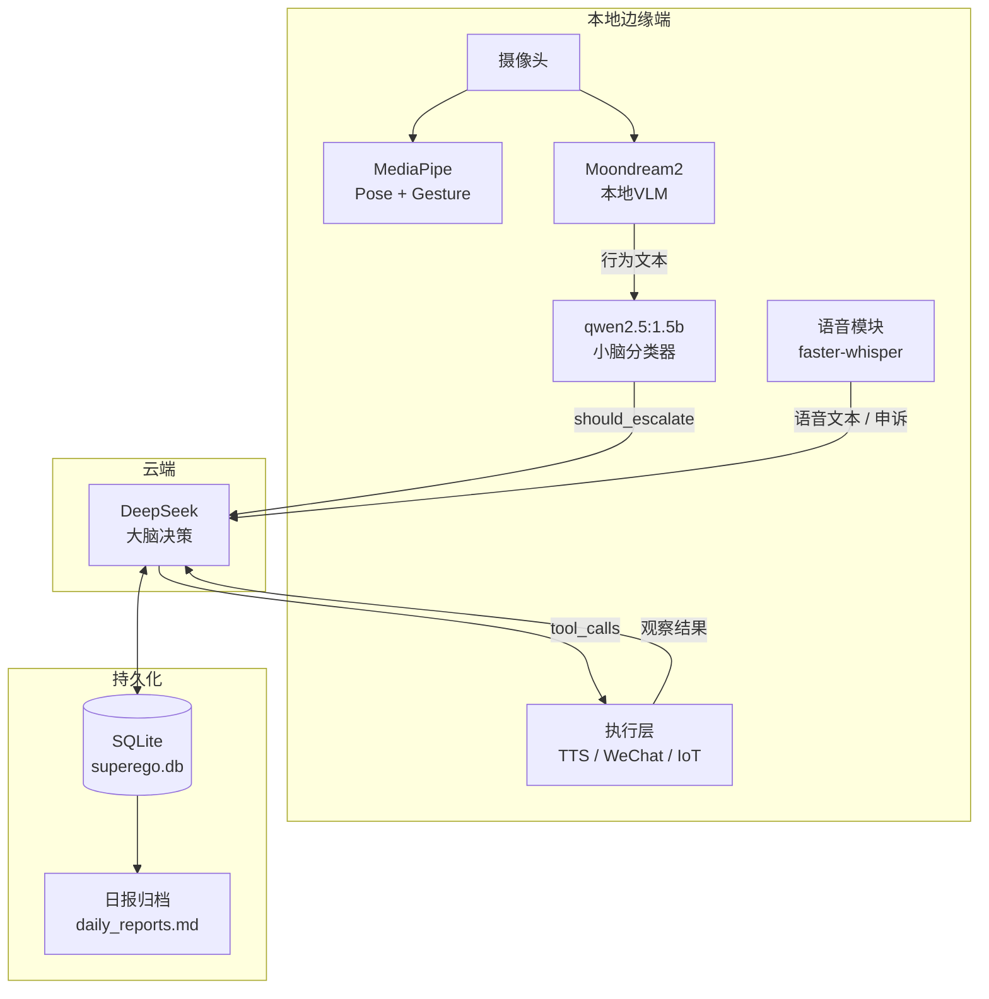
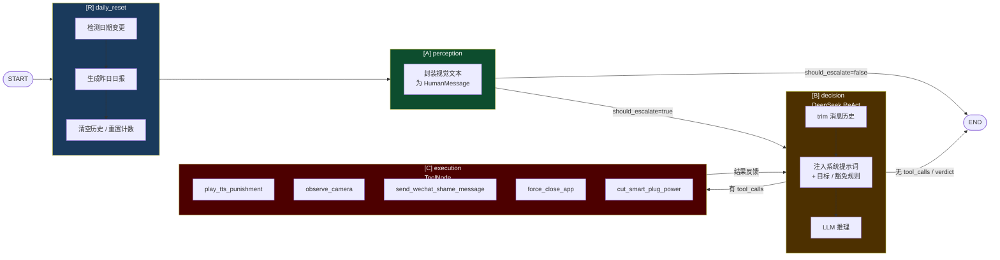
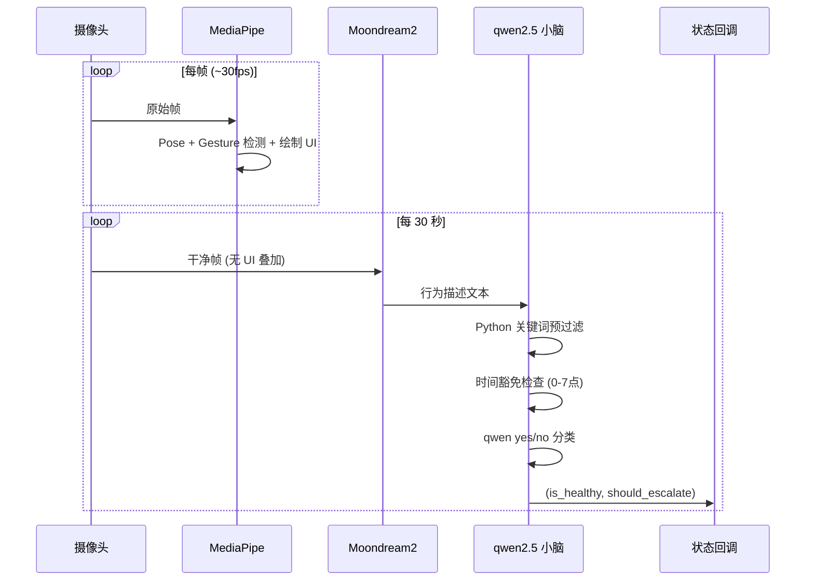
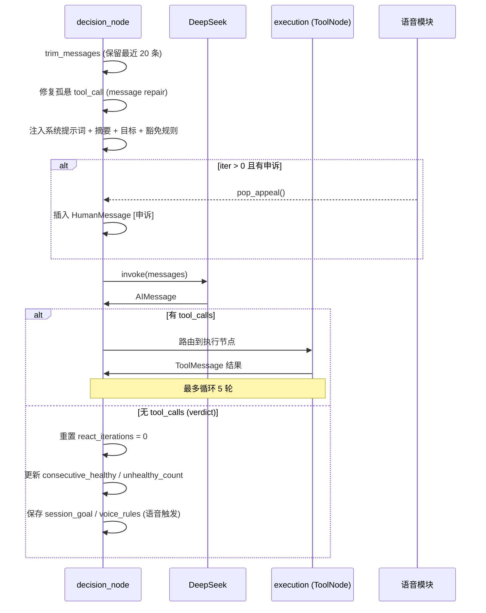
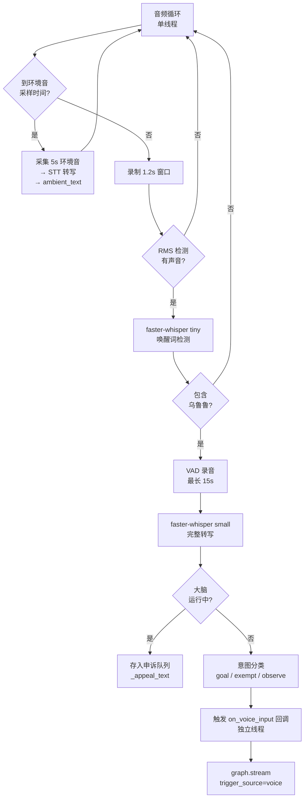
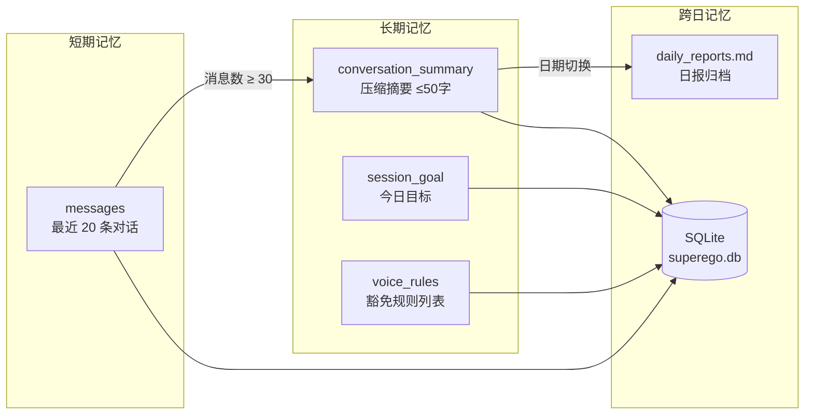

# 赛博超我 (Cyber-Superego)

> 一个基于 LangGraph 的边缘-云端混合架构个人自律监督 Agent。
> 全天候监控宿主行为，发现摆烂立即渐进式惩罚。

---

## 项目背景

传统 VLM（视觉大模型）全天候云端调用存在两个致命问题：**高昂的 API 成本**与**图像隐私泄露风险**。

Cyber-Superego 的设计哲学是**双脑协同（Dual-Brain Synergy）**：

- **边缘端小脑**：本地运行轻量模型（MediaPipe + Moondream2 + qwen2.5:1.5b），负责视觉感知和行为初筛。图像永远不离开本地设备。
- **云端大脑**：只接收纯文本行为描述，由 DeepSeek 做高级逻辑推理和惩罚决策，token 消耗极低。
- **本地执行手臂**：云端判决回传本地，接管软硬件执行物理/数字惩罚。

---

## 系统架构总览



---

## LangGraph 状态机



> ReAct 循环（B ⇌ C）最多执行 `REACT_MAX_ITERATIONS=5` 轮，超限强制结束。

---

## 节点详解

### [R] daily_reset — 每日重置

每轮图执行的入口，同一天内近乎零开销。

- 检测 `session_date` 是否变更
- 调用 DeepSeek 生成前一天的自律日报，追加到 `memory/daily_reports.md`
- 清空所有历史消息，将日报作为新一天的初始 `conversation_summary`
- 重置：`unhealthy_count`, `consecutive_healthy`, `session_goal`, `voice_rules`

### [A] perception — 感知层

将外部感知数据（由 `perception.py` 实时采集）包装为 LLM 消息。

**感知流水线（`perception.py`）：**



**小脑路由策略（疑罪从无）：**
1. Python 关键词预过滤（明确出现摆烂词汇 → 直接 unhealthy）
2. 时间豁免：0:00–6:59 一律放行
3. qwen2.5:1.5b 做最终 yes/no 判断
4. 结果不明确 → 默认 healthy

### [B] decision — 云端决策（DeepSeek ReAct）



**渐进式惩罚标准流程：**
1. 发现摆烂 → `play_tts_punishment`（语音警告）
2. 调用 `observe_camera`（等待 30s，观察响应）
3. 仍在摆烂 → 升级：`play_tts_punishment` + `send_wechat_shame_message`
4. 已收手 → 冷嘲一句结束

### [C] execution — 本地执行工具库

| 工具 | 说明 | 状态 |
|------|------|------|
| `play_tts_punishment` | TTS 播放嘲讽语音 | Mock |
| `observe_camera` | 等待 30s 后重新观察摄像头 | Mock |
| `send_wechat_shame_message` | 接管鼠标向微信联系人发送社死消息 | Mock |
| `force_close_app` | 强制关闭指定应用 | Mock |
| `cut_smart_plug_power` | 向 IoT 插座发送断电指令 | Mock |

> `observe_camera` 必须单独调用，不可与其他工具并发（`parallel_tool_calls=False`）。

---

## 语音模块架构



**意图分类关键词：**
- `goal`：今天目标、目标是、今天计划、计划是、我要完成
- `exempt`：今天休息、休息日、不用学习、豁免、我今天可以、放假、我在开会
- `observe`：其他（默认）

---

## 状态持久化与记忆系统



- **消息压缩**：`len(messages) >= 30` 时，调用 DeepSeek 压缩历史为 50 字摘要，删除旧消息保留最新 5 条
- **每日重置**：跨日时生成日报，清空消息，`conversation_summary` 初始化为日报内容
- **checkpointer**：`SqliteSaver` 以固定 `thread_id="superego_main"` 跨进程持久化

---

## 快速开始

### 前置条件

1. Python 3.12+，安装 [uv](https://docs.astral.sh/uv/)
2. 启动 Ollama：`open /Applications/Ollama.app`
3. 拉取本地模型：
   ```bash
   ollama pull moondream
   ollama pull qwen2.5:1.5b
   ```
4. 下载模型文件到项目根目录：
   - `pose_landmarker_lite.task`（MediaPipe Pose，5.5MB）
   - `gesture_recognizer.task`（MediaPipe Gesture，8MB）
5. 创建 `.env`：
   ```
   DEEPSEEK_API_KEY=your_key_here
   ```

### 安装与运行

```bash
# 安装依赖
uv sync

# 启动完整系统（摄像头 + 语音 + 图流转）
uv run main.py

# 仅测试 LangGraph 图流转（无需摄像头，使用 Mock 状态）
uv run main.py --graph

# 仅测试感知节点（摄像头 + MediaPipe + Moondream，无云端调用）
uv run python perception.py
```

---

## 文件结构

```
wakeupagent/
├── main.py                    # 入口，串联感知/语音/图
├── graph.py                   # LangGraph 状态机（四节点）
├── perception.py              # 摄像头感知流水线
├── voice.py                   # 语音唤醒/STT/申诉模块
├── tools.py                   # Node C 工具库（当前全 Mock）
├── config.py                  # 全局配置常量
├── pose_landmarker_lite.task  # MediaPipe Pose 模型
├── gesture_recognizer.task    # MediaPipe Gesture 模型
├── superego.db                # SQLite 持久化（运行时生成）
└── memory/
    └── daily_reports.md       # 每日日报归档（运行时生成）
```

---

## 关键配置

| 参数 | 默认值 | 说明 |
|------|--------|------|
| `CAPTURE_INTERVAL_SEC` | 30 | 摄像头扫描间隔（秒） |
| `REACT_MAX_ITERATIONS` | 5 | ReAct 最大惩罚轮次 |
| `CONTEXT_MAX_MESSAGES` | 20 | trim_messages 保留条数 |
| `SUMMARIZE_THRESHOLD` | 30 | 触发记忆压缩的消息数 |
| `WAKE_WORD` | 乌鲁鲁 | 语音唤醒词 |
| `LOCAL_CLASSIFIER_MODEL` | qwen2.5:1.5b | 小脑分类模型 |
| `DEEPSEEK_MODEL` | deepseek-chat | 云端大脑模型 |

所有配置均在 `config.py` 中修改。

---

## 待实现

- [ ] **Node C 真实工具**：TTS（Edge TTS / pyttsx3）、PyAutoGUI 微信接管、IoT 插座控制
- [ ] **interrupt_before**：高风险工具（微信、断电）接入前需加人工确认
- [ ] **摘要压缩独立节点**：将 `_summarize_messages` 拆为独立 LangGraph 节点，避免 decision_node 延迟
- [ ] **多摄像头支持**：`_latest_raw_frame` 改为 `dict[int, ndarray]`
- [ ] **Web UI**：AsyncSqliteSaver + astream，感知进程与 Web 进程通过队列通信
