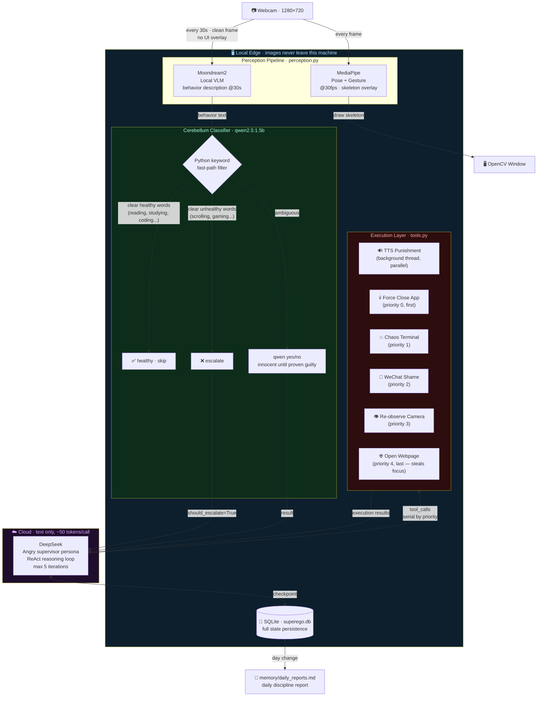
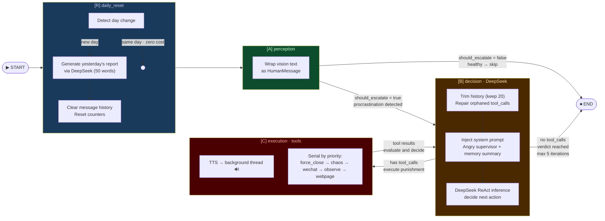

<div align="center">

# 🧠 Cyber-Superego · 赛博超我

**An edge-cloud hybrid AI agent that watches you work — and punishes you when you don't.**

*Powered by LangGraph · MediaPipe · Moondream2 · DeepSeek · macOS Automation*

[](https://python.org)
[](https://langchain-ai.github.io/langgraph/)
[](LICENSE)
[](https://apple.com/macos)
[](https://ollama.com)

[English](#english) · [中文](#中文)

</div>

---

## English

### What is this?

Cyber-Superego is a **privacy-first, edge-cloud hybrid AI supervisor** that monitors your behavior through your webcam 24/7 and intervenes with escalating punishments the moment it detects procrastination.

The core design insight: **your camera image never leaves your machine.** A local vision model describes what it sees in plain text; only that text description reaches the cloud LLM. This keeps API costs minimal and protects your privacy.

### What can it do?

| Detected Behavior | System Response |
|---|---|
| Scrolling phone / watching videos | TTS voice scolds you out loud |
| Still slacking after warning | Sends a shame message to your mom on WeChat |
| Gaming when you should be studying | Force-closes the game, opens LeetCode |
| Repeatedly ignoring warnings | **Chaos mode**: 50 terminal windows flood your screen, 5-language concurrent TTS |
| Actually studying | Leaves you alone (with a brief sarcastic comment) |

### Architecture

The system uses a **Dual-Brain Synergy** design to solve the fundamental tension between privacy, cost, and intelligence:

```
┌─────────────────────────────────────────────────────────────┐
│  LOCAL EDGE  (images never leave this machine)              │
│                                                             │
│  Webcam → MediaPipe    → skeleton overlay on screen         │
│         ↓ (every 30s)                                       │
│         → Moondream2   → plain-text behavior description    │
│         → qwen2.5:1.5b → healthy / procrastinating?         │
│                              ↓ (if procrastinating)         │
├──────────────────────────────┼──────────────────────────────┤
│  CLOUD  (text only, ~50 tokens per call)                    │
│                              ↓                              │
│              DeepSeek → ReAct reasoning loop                │
│                              ↓                              │
├──────────────────────────────┼──────────────────────────────┤
│  LOCAL EXECUTION             ↓                              │
│         TTS / WeChat automation / force-close / chaos mode  │
└─────────────────────────────────────────────────────────────┘
```



### LangGraph State Machine

Every 30-second perception cycle triggers one full graph execution. The `[B] ⇌ [C]` loop runs up to 5 times, delivering escalating punishment until the subject complies or the limit is reached.



### Cerebellum: Three-Layer Behavior Classifier

Before any cloud call, a local three-layer classifier filters behavior descriptions to minimize unnecessary API usage:

```
Vision text (e.g. "person reading a programming book at desk")
        │
        ▼
Layer 1 · Python whitelist (zero LLM cost)
  keywords: "reading a book", "studying", "coding", "working at desk"...
        → immediately healthy ✅ (most study sessions caught here)
        │
        ▼ (not matched)
Layer 2 · Python blacklist (zero LLM cost)
  keywords: "scrolling", "gaming", "watching tv", "lying in bed"...
        → immediately escalate ❌
        │
        ▼ (ambiguous)
Layer 3 · qwen2.5:1.5b yes/no classification
  "Is this person clearly doing something unproductive?"
  Rule: innocent until proven guilty — unclear answer → healthy default
```

> **Why not inject conversation history into qwen?** Testing showed that feeding the small 1.5B model prior LLM conversations (containing scolding text in Chinese) caused ~12% false-positive rate on clearly healthy behaviors. The classifier now sees only the current frame description.

### Punishment Escalation

```
Round 1 · TTS voice warning          "你他妈在干嘛，给老子去学习！"
Round 2 · observe_camera             Wait 30s, re-check behavior
Round 3 · TTS + WeChat + webpage     Three-hit combo — mom gets a message
Round 4 · chaos_terminal_punishment  50 terminals + 5-language concurrent TTS
Round 5 · forced END                 Max iterations reached
```

### Key Design Decisions

| Decision | Rationale |
|---|---|
| Images stay local | Privacy + zero vision API cost |
| qwen2.5:1.5b as cerebellum | 99% of classifications need no cloud call |
| DeepSeek for decisions | Reasoning quality at minimal token cost |
| TTS runs in background thread | Non-blocking; plays while other tools execute |
| Tools execute serially by priority | WeChat automation needs focus; browser runs last |
| `_reorder_and_repair` message repair | Crash-safe: orphaned tool_calls in SQLite are patched on restart |

---

## 中文

### 这是什么？

赛博超我是一个**隐私优先的边缘-云端混合 AI 监督 Agent**，通过摄像头全天候监控你的行为，一旦检测到摆烂立即介入并施以渐进式惩罚。

核心设计原则：**摄像头画面永远不离开你的设备。** 本地视觉模型将画面描述为纯文本，云端 LLM 只接收这段文字，既保护隐私，又将 API 成本压到极低。

### 它能做什么？

| 检测行为 | 系统响应 |
|---|---|
| 刷手机 / 看视频 | TTS 语音骂你 |
| 警告后仍在摆烂 | 给你妈发微信 |
| 该学习时打游戏 | 强制关闭游戏，打开 LeetCode |
| 屡教不改 | **混沌模式**：50 个终端刷屏 + 5 语言 TTS 齐轰 |
| 认真学习 | 冷嘲一句，不打扰 |

---

## Setup Guide

### Requirements

| Requirement | Details |
|---|---|
| **OS** | macOS (required for `say`, `osascript`, `open -a`) |
| **Python** | 3.12+ |
| **Package manager** | [uv](https://docs.astral.sh/uv/) |
| **Ollama** | [ollama.com](https://ollama.com) |
| **DeepSeek API** | [platform.deepseek.com](https://platform.deepseek.com) |

### Step 1 — Clone and install dependencies

```bash
git clone https://github.com/yourname/wakeupagent.git
cd wakeupagent
uv sync
```

### Step 2 — Pull local models via Ollama

```bash
# Start Ollama first
open /Applications/Ollama.app

# Pull the two required models (~2 GB total)
ollama pull moondream      # Vision model — describes what the camera sees
ollama pull qwen2.5:1.5b   # Cerebellum — classifies behavior as healthy/unhealthy
```

### Step 3 — Download MediaPipe model files

Download these two files and place them in the project root directory:

| File | Size | Link |
|---|---|---|
| `pose_landmarker_lite.task` | 5.5 MB | [Download](https://storage.googleapis.com/mediapipe-models/pose_landmarker/pose_landmarker_lite/float16/latest/pose_landmarker_lite.task) |
| `gesture_recognizer.task` | 8 MB | [Download](https://storage.googleapis.com/mediapipe-models/gesture_recognizer/gesture_recognizer/float16/latest/gesture_recognizer.task) |

### Step 4 — Configure environment

```bash
cp .env.example .env
```

Edit `.env`:
```
DEEPSEEK_API_KEY=your_deepseek_api_key_here
```

### Step 5 — Customize contacts in config.py

Open `config.py` and replace the placeholder WeChat contact names:

```python
WECHAT_CONTACTS = {
    "老妈":   "YOUR_MOM_WECHAT_NAME",   # Exact name as shown in WeChat search
    "导师":   "YOUR_TUTOR_WECHAT_NAME",
    "班级群": "YOUR_CLASS_GROUP_NAME",
}
```

> ⚠️ These values must **exactly match** how the contact appears in WeChat's search bar.

### Step 6 — Grant Accessibility permission (WeChat automation)

**System Settings → Privacy & Security → Accessibility**

Add your terminal app (Terminal / iTerm2 / Cursor / VS Code). This is required for the `osascript` WeChat automation to work.

### Step 7 — Run

```bash
# Full system — live webcam + AI supervision
uv run main.py

# Test the LangGraph flow without a camera (mock input)
uv run main.py --graph

# Test perception pipeline only — camera + MediaPipe + Moondream, no cloud
uv run perception.py
```

### Startup checklist

- [ ] Ollama is running with `moondream` and `qwen2.5:1.5b` pulled
- [ ] Both `.task` model files are in the project root
- [ ] `.env` contains a valid `DEEPSEEK_API_KEY`
- [ ] Terminal has Accessibility permission (for WeChat)
- [ ] WeChat Mac client is logged in and running
- [ ] `WECHAT_CONTACTS` in `config.py` has real contact names

---

## Configuration Reference

All settings live in `config.py`. No other files need to be edited for normal use.

| Parameter | Default | Description |
|---|---|---|
| `CAMERA_INDEX` | `0` | Webcam index. Use `1` or `2` for external cameras |
| `CAPTURE_INTERVAL_SEC` | `30` | Seconds between Moondream vision analyses |
| `REACT_MAX_ITERATIONS` | `5` | Max punishment rounds per session |
| `CONTEXT_MAX_MESSAGES` | `20` | Recent messages kept in LLM context |
| `SUMMARIZE_THRESHOLD` | `30` | Message count that triggers memory compression |
| `LOCAL_CLASSIFIER_MODEL` | `qwen2.5:1.5b` | Cerebellum model (must be available in Ollama) |
| `DEEPSEEK_MODEL` | `deepseek-chat` | Cloud brain model |
| `MOONDREAM_PROMPT` | `"What is the person doing?"` | Controls Moondream's description angle |
| `WECHAT_CONTACTS` | placeholders | **Must be customized** — WeChat contact names |

---

## File Structure

```
wakeupagent/
│
├── main.py                     # Entry point — wires perception callbacks to graph execution
├── graph.py                    # LangGraph state machine — 4 nodes, routing, memory compression
├── perception.py               # Perception pipeline — MediaPipe + Moondream + cerebellum
├── tools.py                    # Execution tool library — all 6 tools fully implemented
├── config.py                   # All configuration in one place
│
├── pose_landmarker_lite.task   # MediaPipe Pose model (download separately, not in repo)
├── gesture_recognizer.task     # MediaPipe Gesture model (download separately, not in repo)
│
├── pyproject.toml              # Dependencies (managed with uv)
├── .env.example                # Environment variable template
├── .env                        # Your API keys — never commit this
│
└── memory/
    └── daily_reports.md        # Auto-generated daily discipline reports (runtime)
```

---

## FAQ

**Q: The system keeps flagging me as procrastinating even when I'm studying.**
The cerebellum uses "innocent until proven guilty" — ambiguous cases default to healthy. If you're consistently misclassified, add the specific words Moondream uses to describe your activity to `_HEALTHY_KEYWORDS` in `perception.py`.

**Q: WeChat messages aren't sending.**
Check: (1) WeChat Mac is logged in and running; (2) your terminal has Accessibility permission; (3) `WECHAT_CONTACTS` values exactly match WeChat search results (including spaces and special characters).

**Q: Can I use a different cloud LLM instead of DeepSeek?**
Yes — DeepSeek uses an OpenAI-compatible API. Change `DEEPSEEK_BASE_URL` and `DEEPSEEK_MODEL` in `config.py` to point at any OpenAI-compatible endpoint (OpenAI, Claude via proxy, etc.).

**Q: The TTS voice sounds wrong / I want a different voice.**
Change `_TTS_VOICE` in `tools.py` to any voice installed on your system. Check available voices in: System Settings → Accessibility → Spoken Content → System Voice.

**Q: Can I run this without WeChat?**
Yes — the system degrades gracefully. If WeChat automation fails, it logs the error and moves on to the next tool. You can also remove `send_wechat_shame_message` from `ALL_TOOLS` in `tools.py`.

---

## Roadmap

- [ ] **Human confirmation**: `interrupt_before` checkpoint for high-risk tools (WeChat, chaos mode)
- [ ] **Cross-platform**: Windows/Linux support via alternative TTS and automation backends
- [ ] **Web UI**: Browser-based monitoring dashboard with `AsyncSqliteSaver` + `astream`
- [ ] **Multi-camera**: Monitor multiple rooms simultaneously
- [ ] **Custom punishment plugins**: Hot-reloadable tool modules
- [ ] **Mobile companion app**: Push notifications when punishment is triggered

---

## License

MIT — do whatever you want, but the author takes no responsibility for family relationship damage caused by unsolicited WeChat messages.
