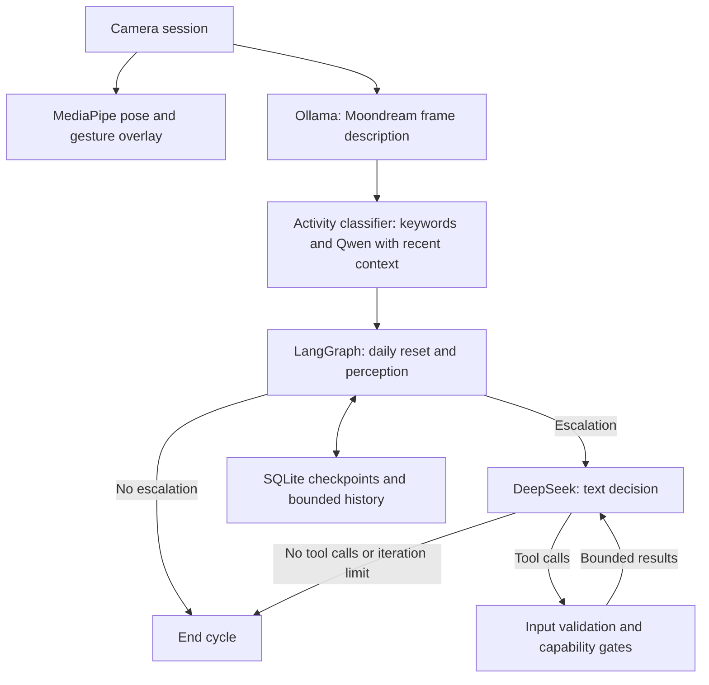

# Cyber-Superego · 赛博超我

**An experimental desktop focus assistant combining local visual perception, a stateful AI agent, and explicitly enabled macOS actions.**

Python 3.12+ · LangGraph · MediaPipe · Ollama · DeepSeek · SQLite

[Architecture](docs/architecture.md) · [Configuration](docs/configuration.md) · [Safety boundaries](docs/side-effects.md) · [Testing](docs/testing.md) · [中文介绍](#中文介绍)

## The project

The product hypothesis is that a focus assistant could help someone notice when they drift from an intended task. The difficult part is deciding when to intervene: watching a tutorial may look like distraction, and an unwanted reminder can become another interruption.

Cyber-Superego explores that tension through a working agent prototype: how can a system turn a noisy camera observation into a useful reminder while keeping the user in control of desktop actions?

The application describes camera frames through an Ollama vision model, classifies activity with local context, and routes selected observations to a LangGraph decision loop. The loop can suggest a next step, request a fresh observation, or use a narrowly scoped desktop tool. Speech, browser navigation, WeChat messaging, and application quit requests are **disabled by default**.

The implementation makes three tradeoffs explicit: local image inference with cloud text reasoning, recent context with bounded retention, and optional assistance with desktop actions disabled until enabled. These choices make the product assumptions inspectable in code; they do not establish that the interventions improve focus.

This is a personal prototype for studying multimodal agents and their execution boundaries. It is not a validated measure of attention or productivity.

## How it works


```mermaid
flowchart TD
    Camera[Camera session] --> Display[MediaPipe pose and gesture overlay]
    Camera --> Vision[Ollama: Moondream frame description]
    Vision --> Classifier[Activity classifier: keywords and Qwen with recent context]
    Classifier --> Graph[LangGraph: daily reset and perception]
    Graph -->|No escalation| End[End cycle]
    Graph -->|Escalation| Decision[DeepSeek: text decision]
    Decision -->|Tool calls| Tools[Input validation and capability gates]
    Tools -->|Bounded results| Decision
    Decision -->|No tool calls or iteration limit| End
    Graph <--> Memory[SQLite checkpoints and bounded history]
```

The capture interval defaults to 30 seconds. A keyword shortcut identifies explicit recreational descriptions when no recent context is available; otherwise Qwen uses the observation and bounded context to distinguish distraction from planned activity. Unclear classifier output or classifier failure defaults to no escalation.

The graph separates daily reset, perception, decision, and execution. It limits decision iterations, compacts message history, and repairs unmatched tool-call records before reuse. Daily reports and summaries can also invoke the cloud model; skipping an escalation is not a guarantee of zero cloud requests.

### Engineering details to inspect

| Concern | Implementation | Example regression coverage |
|---|---|---|
| Camera lifecycle | Session cleanup, frame timestamps, and cancellation in [perception.py](perception.py) | [Lifecycle tests](tests/test_perception_lifecycle.py), [fresh-frame observations](tests/test_observe_camera.py) |
| Agent state | Routing, tool-call repair, and summary compaction in [graph.py](graph.py) | [Graph boundaries](tests/test_graph_state_boundaries.py), [summary compaction](tests/test_graph_summary_compaction.py) |
| Bounded context | Normalization, truncation, and snapshots in [history.py](history.py) | [History snapshots](tests/test_history_snapshots.py), [render budgets](tests/test_history_incremental_render_budget.py) |
| Desktop actions | Capability checks in [tools.py](tools.py), input validators in [safety.py](safety.py) | [Messaging](tests/test_external_messaging.py), [process control](tests/test_process_control.py), [TTS](tests/test_tts_safety.py) |
| Installation | Validated environment settings and offline [diagnostics.py](diagnostics.py) | [CLI isolation](tests/test_main_cli.py), [configuration failures](tests/test_diagnostics_config_failures.py) |

## Data and action boundaries

**Where data goes.** With the default `OLLAMA_HOST=http://localhost:11434`, image inference runs through a local Ollama server. Frames are encoded as temporary JPEG files and deleted in a `finally` block after inference. Setting a remote Ollama endpoint sends those images to that endpoint. The DeepSeek decision layer receives text, including camera-derived descriptions and relevant conversation context; text can still contain private information. SQLite checkpoints and daily reports retain local session information. See [privacy](docs/privacy.md) and [security boundaries](docs/security-boundaries.md).

**What the agent can change.** Each desktop capability has its own local gate:

| Capability | Enable flag | Actual behavior |
|---|---|---|
| Speech | `WAKEUP_ALLOW_TTS` | Speak a bounded reminder using macOS `say` |
| Browser | `WAKEUP_ALLOW_BROWSER_CONTROL` | Open a validated HTTP(S) URL |
| WeChat | `WAKEUP_ALLOW_EXTERNAL_MESSAGING` | Send a message to a configured contact alias through macOS UI automation |
| Application control | `WAKEUP_ALLOW_PROCESS_CONTROL` | Request a graceful quit of one explicitly named application |

All four flags default to `false`. Enabling a capability lets the agent invoke it; **there is no per-action confirmation dialog**. WeChat additionally requires an explicit local alias mapping and appropriate Accessibility permissions. Configure only capabilities you intend to allow, and keep real contact names in the untracked `.env` file.

Some tool identifiers retain historical names such as `play_tts_punishment` and `force_close_app`. The current prompt asks for brief, non-abusive reminders, and application control requests a normal quit rather than a process kill. Legacy chaos mode is inert and is not registered as an available tool. See [the full side-effect contract](docs/side-effects.md).

## Getting started

The interactive application targets **macOS**. Use Python 3.12+ and the `uv` version required by [pyproject.toml](pyproject.toml), currently **0.12.7**. Live perception also needs a camera, macOS camera permission, Ollama, and the configured models. Cloud decisions need a DeepSeek API key.

```bash
git clone https://github.com/Leonxu6/wakeupagent.git
cd wakeupagent
uv sync --frozen
cp .env.example .env
```

Keep the action flags disabled for the first run. Add your own `DEEPSEEK_API_KEY` to `.env` without committing it. The other supported settings are listed in [.env.example](.env.example) and the [configuration guide](docs/configuration.md).

### 1. Inspect the installation without running the agent

```bash
uv run main.py --check
uv run main.py --check-json
```

These commands inspect configuration, model files, and persistence paths without opening the camera or contacting model services. A missing API key produces a nonzero exit status even if you only intend to inspect the local installation. A passing result does not prove that a camera or model service works; see [diagnostics](docs/diagnostics.md).

### 2. Prepare local perception

Start Ollama, then download the configured models:

```bash
ollama pull moondream
ollama pull qwen2.5:1.5b
```

The repository includes `pose_landmarker_lite.task` and `gesture_recognizer.task` for MediaPipe. Their upstream sources are [Pose Landmarker](https://storage.googleapis.com/mediapipe-models/pose_landmarker/pose_landmarker_lite/float16/latest/pose_landmarker_lite.task) and [Gesture Recognizer](https://storage.googleapis.com/mediapipe-models/gesture_recognizer/gesture_recognizer/float16/latest/gesture_recognizer.task). See [model asset checks](docs/model-assets.md) if either is missing or unreadable.

### 3. Choose a runtime mode

```bash
# Live camera, local perception, and cloud-backed agent decisions
uv run main.py

# Camera and Ollama perception only; no DeepSeek decision loop
uv run perception.py

# Synthetic observation through the real graph; no live camera required
uv run main.py --graph
```

**`--graph` is not an offline simulation:** only its initial observation is synthetic. It uses the real cloud model, writes runtime state, and can invoke any enabled desktop actions. Use the test suite below for offline verification.

Press `q` or Escape in the perception window to end the camera session. Check [troubleshooting](docs/troubleshooting.md) and [failure modes](docs/failure-modes.md) for startup and runtime issues.

## Development and verification

The [CI workflow](.github/workflows/ci.yml) provisions Python 3.12, installs the locked dependencies, compiles maintained Python files, runs repository audits, and executes pytest on Linux. Tool tests mock external effects; passing CI does not establish live macOS automation or model quality.

```bash
uv run python maintenance/run_all.py
uv run --with pytest pytest -q
```

For focused work on desktop boundaries:

```bash
uv run --with pytest pytest -q tests/test_safety.py tests/test_external_messaging.py tests/test_process_control.py
```

Repository maintenance checks run offline. The `uv` commands can download dependencies when first preparing the environment. Read [CONTRIBUTING.md](CONTRIBUTING.md), the [testing guide](docs/testing.md), and the [release process](docs/release-process.md) before changing runtime behavior.

## Limits and next steps

- **Activity is not intent.** Camera descriptions and keyword matches can be wrong. No accuracy, productivity-improvement, or API-cost benchmark is reported here.
- **Opt-in is not approval of every decision.** The next useful interaction improvement is an explicit confirmation step before messaging or requesting an app quit.
- **Desktop automation is platform-dependent.** WeChat UI focus, permissions, installed voices, and application behavior affect results. Automated tests cannot substitute for an end-to-end run on the target machine.
- **Local inference is a configuration choice.** Review endpoint settings and retained session data before using sensitive workspace content.

## 中文介绍

赛博超我是一个实验性的桌面专注助手：通过 MediaPipe 和 Ollama 进行视觉感知，将活动描述和近期上下文交给 LangGraph 管理的决策流程，再由 DeepSeek 生成提醒或选择工具。

这个项目的重点是感知、状态管理与执行边界：摄像头会话清理、新帧校验、有限长度的上下文、工具调用记录修复，以及输入校验和默认关闭的桌面操作。语音、浏览器、微信消息和应用退出请求都需要单独启用；启用后目前没有逐次确认弹窗。旧版混沌模式已经停用，历史工具名称不代表当前行为。

默认 Ollama 地址在本机；配置远程地址会改变图像传输边界。云端收到的是文字，但观察描述、历史摘要和本地保存的会话数据仍可能涉及隐私。项目尚未提供专注度识别准确率或效率提升的验证结果。

建议先运行 `uv run main.py --check` 检查安装，再按上面的步骤启动。`--graph` 只模拟初始观察，仍会调用真实云端模型并使用已启用的工具；离线验证请使用测试套件。

## License

[MIT](LICENSE). See [SECURITY.md](SECURITY.md) for reporting security issues.
